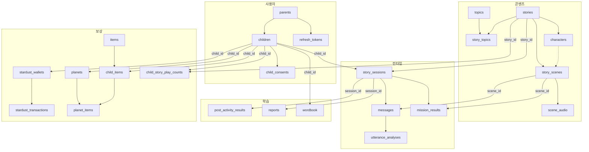
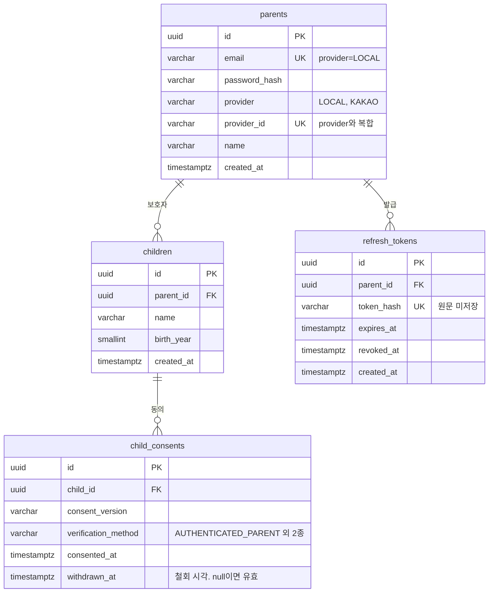
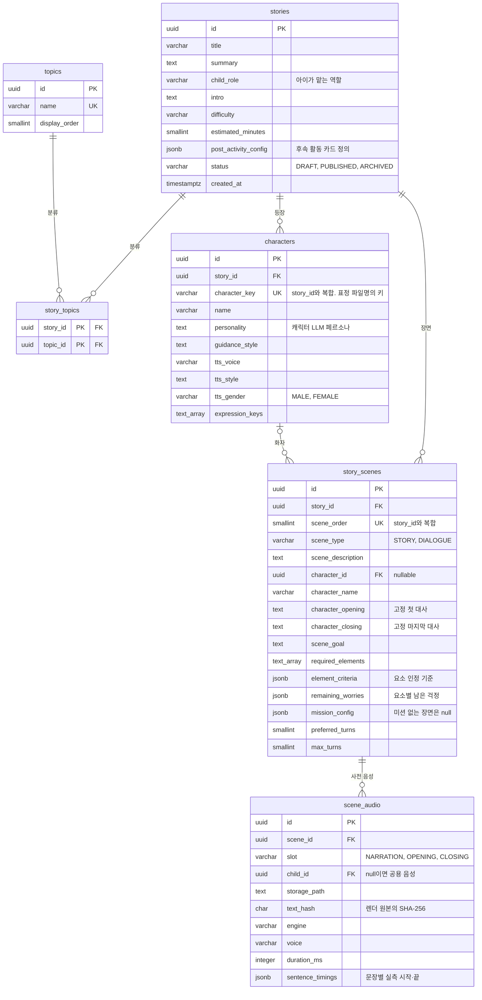
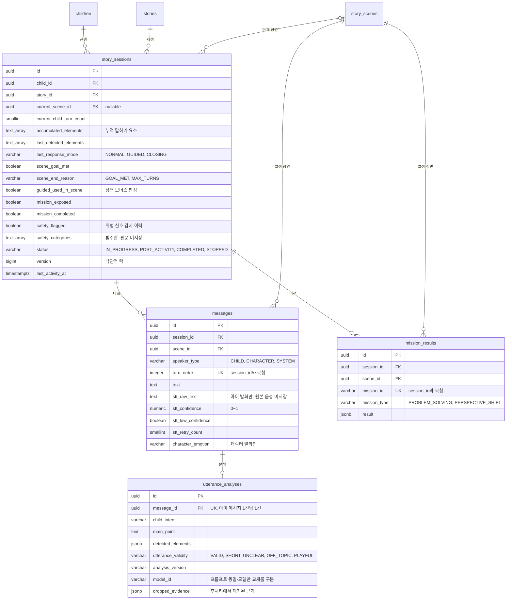
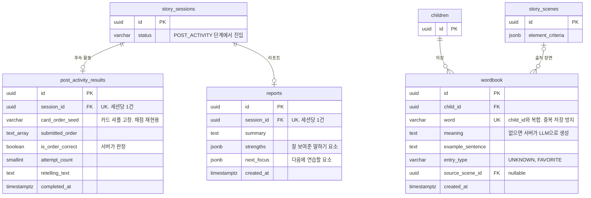
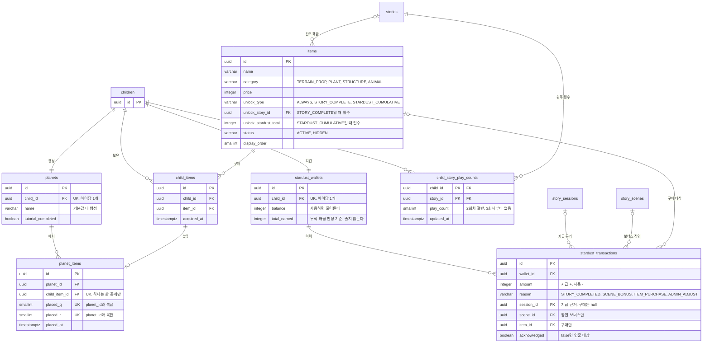

# 굿퀘스천 ERD

> **원본은 [`V1__init_schema.sql`](../src/main/resources/db/migration/V1__init_schema.sql)이다.**
> 이 문서는 그 스키마를 관계 중심으로 다시 그린 것이다. 컬럼 하나하나의 제약과
> 그렇게 정한 근거는 [데이터베이스_설계.md](데이터베이스_설계.md)를 본다.
>
> 스키마를 바꾸면(`V2`, `V3` 추가) 이 문서와 [erd-view.html](erd-view.html)을 함께 고친다.
>
> **그림이 코드로 보인다면** 에디터에 mermaid 렌더러가 없는 것이다. GitHub에서는 그냥
> 보이고, 로컬에서는 [erd-view.html](erd-view.html)을 브라우저로 열면 된다.
> IntelliJ는 Mermaid 플러그인, VS Code는 Markdown Preview Mermaid Support 확장이 필요하다.

---

## 0. 읽는 법

그림이 두 종류다. **전체 지도**는 도메인 묶음과 소유 방향만 보는 흐름도이고,
**도메인별 그림**은 컬럼과 카디널리티까지 담은 ER 다이어그램이다. 아래 표기는
도메인별 그림에 적용된다.

**관계 표기**

| 기호 | 뜻 |
| --- | --- |
| `\|\|--o{` | 1 대 N (왼쪽 1건에 오른쪽 0건 이상) |
| `\|\|--o\|` | 1 대 0~1 (있으면 정확히 1건) |
| `\|\|--\|\|` | 1 대 1 (양쪽 모두 반드시 1건) |
| `\|o--o{` | 0~1 대 N (FK가 nullable) |

**컬럼 표기**

`PK` 기본키, `FK` 외래키, `UK` 유니크 제약. 지면 관계상 관계와 식별에 관여하는
컬럼 위주로 싣고 나머지는 생략했다. 배열 타입(`text[]`)은 `text_array`로 적었다.

**도메인 구분** - 패키지 구조와 같다.

| 도메인 | 테이블 수 | 담당 패키지 |
| --- | --- | --- |
| 사용자와 인증 | 4 | `user` |
| 콘텐츠 | 6 | `story.content` |
| 런타임 | 4 | `story.session`, `story.dialogue`, `story.mission` |
| 학습 | 3 | `learning.postactivity`, `learning.report`, `learning.wordbook` |
| 보상 | 7 | `learning.reward` |

---

## 1. 전체 지도

24개 테이블이 어느 도메인에 속하고 무엇을 소유하는지만 본다. 컬럼과 카디널리티는
아래 도메인별 그림에 있다.



**선을 정리한 기준**

FK 35개를 다 그리면 선이 엉켜 읽을 수 없다. 두 가지로 줄였다.

1. 테이블을 도메인으로 묶었다. **상자 안 관계는 빠짐없이 그렸다.**
2. 도메인을 넘는 참조는 **not null만** 그리고 화살표에 FK 컬럼 이름을 달았다.
   화살표는 소유 방향이며 카디널리티는 표시하지 않는다.

이 기준으로 생략되는 것은 아래 7개이고, 전부 nullable 크로스 도메인 참조다.
없어도 소유 구조가 그대로 읽히고, 도메인별 그림에는 모두 그려져 있다.

| 참조 | FK 컬럼 | 무엇인가 |
| --- | --- | --- |
| `story_sessions` -> `story_scenes` | `current_scene_id` | 세션이 지금 있는 장면 |
| `wordbook` -> `story_scenes` | `source_scene_id` | 단어가 나온 장면 |
| `items` -> `stories` | `unlock_story_id` | 완주로 해금되는 이야기 |
| `stardust_transactions` -> `story_sessions` | `session_id` | 지급 근거 세션 |
| `stardust_transactions` -> `story_scenes` | `scene_id` | 장면 보너스의 장면 |
| `stardust_transactions` -> `items` | `item_id` | 구매 대상 아이템 |
| `scene_audio` -> `children` | `child_id` | 아이별로 렌더한 음성 |

점선으로 그린 `characters -> story_scenes`도 nullable이지만 도메인 안이라 남겼다.

---

## 2. 사용자와 인증



`refresh_tokens`는 테이블만 있고 **어떤 서비스도 참조하지 않는다.** 현재는 Access
토큰 단일 전략이다. 근거는 [API_및_DTO_명세.md 8절](API_및_DTO_명세.md)에 있다.

동의는 행을 지우지 않고 `withdrawn_at`을 채워 철회한다. 이력이 남아야 하기 때문이다.

---

## 3. 콘텐츠

정적 콘텐츠다. 런타임 상태를 알지 못하며, 수정은 복사 등록으로 처리한다(데이터-02).



`story_scenes`가 `character_name`과 `character_id`를 함께 가진다. 이름은 화면 표시용이고
페르소나/보이스/표정은 FK로 찾는다. 장면마다 화자 페르소나가 따로 있으면 같은 캐릭터가
장면별로 다른 목소리로 합성되는 것을 막을 수 없어 `characters`를 분리했다.

`scene_audio.child_id`가 nullable인 이유는, 아이 이름이 들어가는 대사만 아이별로
렌더하고 나머지는 공용 음성을 쓰기 때문이다.

---

## 4. 런타임

세션이 진행되면서 쌓이는 상태다. 여기부터는 아이별 데이터다.



`story_sessions.version`은 낙관적 락이다. 턴 처리가 STT/분석/대사 생성으로 수 초 걸려
연타가 들어오면 턴 카운터와 누적 요소가 덮어써지는데, 이걸 409로 바꾼다.

`messages`의 `unique (session_id, turn_order)`가 턴 중복을 막는다.

---

## 5. 학습

세션이 끝난 뒤의 산출물을 다룬다.



구현 시 걸리는 제약이 세 개 있다.

- `post_activity_results.card_order_seed`가 **not null**이다. 카드 순서를 시드로 고정해야
  재진입/재시도에도 같은 화면이 나오고 채점이 재현된다. `/start`에서 시드를 만들어 저장한다.
- `is_order_correct`는 **서버가 판정한다.** `stories.post_activity_config`의 `correct_order`와
  비교하며 클라이언트 판정을 받지 않는다.
- `wordbook`의 `unique (child_id, word)`가 중복 저장을 막는다. 위반 시 409 `DUPLICATE_WORD`다.

`post_activity_results`와 `reports` 모두 세션당 1건(`session_id` 유니크)이라 재호출은
생성이 아니라 조회 또는 409가 된다.

---

## 6. 보상

별가루를 벌어 아이템을 사고 행성에 배치한다. 테이블이 7개로 가장 많다.



구현 시 걸리는 제약이 다섯 개 있다.

- **지갑과 행성은 아이 생성 시 자동으로 만들어진다.** `RewardProvisioningListener`가
  `ChildCreatedEvent`를 받아 같은 트랜잭션에서 각 1건씩 만든다. 보상 API는 조회/변경만 한다.
- **`total_earned`는 줄지 않는다.** 별가루를 써도 `balance`만 줄고 이 값은 유지된다.
  `STARDUST_CUMULATIVE` 해금 판정 기준이기 때문이다.
- **지급 멱등을 부분 유니크 인덱스가 보장한다.** 완주 보상은 `(session_id, reason)`,
  장면 보너스는 `(session_id, scene_id, reason)`로 나눠 건다. 하나로 묶으면 장면 보너스
  2건째가 유니크 위반으로 막힌다.
- **같은 아이템을 여러 개 살 수 있다.** `child_items`에 `(child_id, item_id)` 유니크가 없다.
  대신 `planet_items.child_item_id`가 유니크라 보유분 하나는 한 곳에만 놓인다.
- **치우기는 `planet_items` 행 삭제이고 `child_items`는 남는다.** 이게 보관함 복귀다.
  아이템 행 자체는 지워지지 않으므로 운영 중 내리기는 `items.status=HIDDEN`으로 한다.

`planet_items`의 한계 하나. 발판이 2x2인 아이템은 앵커 칸만 저장하므로 나머지 칸의 겹침을
`unique (planet_id, placed_q, placed_r)`가 막지 못한다. 클라이언트 카탈로그의 발판 정의로
서버가 점유 칸을 계산해 검증해야 한다.

---

## 7. 삭제 전파

`on delete cascade`가 걸린 곳이다. 위쪽을 지우면 아래가 함께 지워진다.

```
parents
+--- children
|    +--- child_consents
|    +--- story_sessions
|    |    +--- messages
|    |    |    +--- utterance_analyses
|    |    +--- mission_results
|    |    +--- post_activity_results
|    |    +--- reports
|    +--- wordbook
|    +--- stardust_wallets
|    |    +--- stardust_transactions
|    +--- child_items
|    |    +--- planet_items
|    +--- child_story_play_counts
|    +--- planets
|    |    +--- planet_items
|    +--- scene_audio (아이별 렌더분만)
+--- refresh_tokens

stories
+--- story_topics
+--- characters
+--- story_scenes
     +--- scene_audio
     +--- messages (restrict. 세션이 있으면 못 지운다)
```

예외 두 가지다.

- `story_sessions.story_id`와 `child_items.item_id`, `stardust_transactions.item_id`는
  cascade가 아니다. 진행 기록이 있는 콘텐츠나 누가 산 아이템은 지울 수 없다.
- `story_scenes.character_id`, `stardust_transactions.session_id`, `.scene_id`는
  `on delete set null`이다. 참조 대상이 사라져도 행은 남는다.
